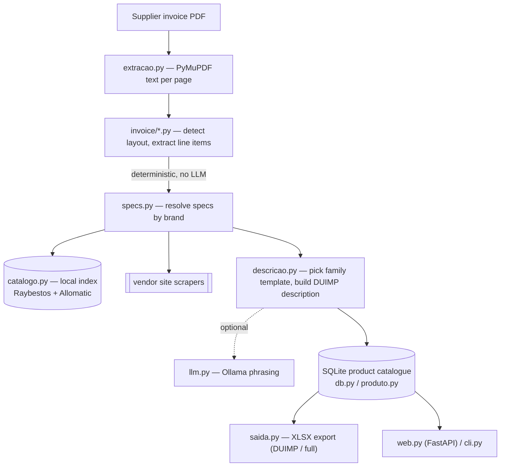

# desc-hub

Turns a supplier invoice PDF into the standardized product descriptions Brazil's customs import declarations (**DUIMP / Siscomex Catálogo de Produtos**) require, for automatic-transmission spare parts.


## What it solves

Importing auto parts means restating every line of a supplier invoice in the exact shape Siscomex expects: the right product family, the right technical attributes in the right order, the right NCM code, plus the fields that repeat across the whole declaration. Done by hand it is slow and drifts between operators. This tool reads the invoice, identifies each part, fills a per-family template, keeps the result in a product catalogue, and exports a spreadsheet ready for the declaration.

The load-bearing design decision: **the language model never touches invoice data.** Part numbers, quantities, prices and country of origin are pulled by deterministic per-supplier parsers; specs come from an offline catalogue index or from vendor-site scrapers. The LLM (Ollama) is optional and only phrases the final prose description — so a model hallucination can never change a number that goes to customs. Whatever cannot be confirmed is flagged for human review, never invented.

## Features

- **Deterministic invoice parsers** (`src/invoice/`): five layouts — Gearbox (the reference parser, which carries mixed Raybestos / Allomatic / Steel Parts items), Sonnax, TriComponent, PS Bearings and Alto — each behind a common `Protocol` and auto-registered on import. Detection is by invoice header, not filename.
- **Brand-keyed spec resolution** (`src/specs.py`): an offline local catalogue index is the primary source, then a JSON scrape cache, then six vendor-site scrapers (Raybestos, Allomatic, Sonnax, TriComponent, PS Bearings, Alto). No confident match ⇒ the item goes to the review queue instead of guessing.
- **Template-driven classification & description**: 20 YAML product-family templates in `data/templates/` (friction discs, steel discs, sprag/one-way clutch, bearings, seal rings, filters, springs, rivets, repair kits, transmission bands, valves, complete kits…), each carrying its NCM and its trigger rules; routing is by trigger match with explicit priority (`src/descricao.py`).
- **SQLite product catalogue as the center** (`src/db.py`): each code is a full record (DUIMP block + commercial/logistics fields + image); the pipeline upserts into it and never overwrites human-entered fields.
- **XLSX export in two layouts** (`src/saida.py`, openpyxl): the 16-column DUIMP sheet (last three columns are review support) and a full sheet zipped alongside an `imagens/` folder.
- **Two interfaces**: a FastAPI single-page web app (vanilla HTML/CSS/JS, no build step) and a command-line tool.
- **Token-gated web access** (`src/acesso.py`): the catalogue and edit routes require a PBKDF2-hashed password that mints a daily HMAC token; the torque-converter price lookup stays open for read.
- **Siscomex catalogue import** (`src/siscomex.py`) to backfill the Siscomex product code, and a spreadsheet round-trip importer (`src/importacao.py`).
- **Optional LLM phrasing** via Ollama (local when `OLLAMA_API_KEY` is empty, otherwise cloud), enabled per run with `--ia`. Without it the pipeline is fully deterministic.

## Stack

Python ≥ 3.12 · FastAPI ≥ 0.110 + Uvicorn ≥ 0.27 · Pydantic v2 + pydantic-settings ≥ 2 · PyMuPDF ≥ 1.24 (PDF text extraction) · openpyxl ≥ 3.1 (XLSX) · selectolax ≥ 0.3 (HTML scraping) · httpx ≥ 0.27 · PyYAML ≥ 6 · Rich ≥ 13 · SQLite (stdlib). Dev: pytest ≥ 8, ruff ≥ 0.4, mypy ≥ 1.10.

## Architecture



Three domain stages carry the data (`src/dominio.py`): `ItemInvoice` (what came out of the PDF) → `SpecProduto` (what a source confirmed about the code) → the description field of a `Produto` (what gets registered). The catalogue is the source of truth; the DUIMP description is one of its columns.

## Getting started

Prerequisites: Python 3.12+ and a recent `pip`.

```bash
git clone https://github.com/YOUR_USERNAME/desc-hub.git
cd desc-hub

python -m venv .venv && source .venv/bin/activate
pip install -e .

cp .env.example .env        # adjust host/port, folders, and Ollama settings
```

### Web interface

```bash
python run.py               # uvicorn on HOST:PORT from .env (default 0.0.0.0:8000)
```

Set the catalogue password before first use (it also rotates the token secret):

```bash
python -m src.acesso "YourPassword"
```

### Command line

```bash
python -m src.cli --pdf invoice.pdf                       # -> data/saida/descricoes.xlsx
python -m src.cli --pdf invoice.pdf --saida out.xlsx      # custom output name
python -m src.cli --pdf invoice.pdf --limite 6 --ia       # first 6 items, LLM phrasing on
```

The run prints the detected parser, how many products landed in the batch, and which came out incomplete and why.

### Tests and linting

```bash
pip install -e ".[dev]"

python tests/test_templates.py        # template routing + NCM integrity (offline)
python tests/test_gearbox_parser.py   # invoice extraction: shipped vs ordered, ORIGIN vs "Made in" (offline)
python tests/test_raybestos_lookup.py # live integration against the Raybestos site (auto-skips offline)

ruff check .
mypy src
```

> `pytest` also collects these, but `test_raybestos_lookup.py` performs live HTTP and only auto-skips when run directly as a script — offline it will fail under `pytest`. Run the two offline tests as scripts (as above) for a network-free check.

### Configuration

All settings live in `.env` (see `.env.example`): `HOST`, `PORT`, the data folders, and the Ollama connection (`OLLAMA_BASE_URL`, `OLLAMA_MODEL`, `OLLAMA_API_KEY`). Leave `OLLAMA_API_KEY` empty and point `OLLAMA_BASE_URL` at `http://localhost:11434` to run the model locally.

## Project structure

```
run.py                 web server entry point (uvicorn)
pyproject.toml         project metadata, deps, ruff/pytest config
.env.example           configuration template
formato_descrições     description-standard notes (Portuguese, design reference)
src/
  invoice/             one parser per invoice layout (+ base Protocol/registry)
  extracao.py          PDF -> text per page (PyMuPDF)
  specs.py             spec resolution by brand: catalogue -> cache -> site scrapers
  catalogo.py          offline index of Raybestos/Allomatic catalogue PDFs
  descricao.py         template routing + DUIMP description assembly
  llm.py               optional Ollama client (prose only)
  dominio.py           domain types (ItemInvoice / SpecProduto / DescricaoDUIMP)
  produto.py           the Produto record and completeness rules
  db.py                SQLite schema + connection (WAL, auto-migration)
  saida.py             XLSX export (DUIMP / full)
  acesso.py            password + daily-token access control
  siscomex.py          import the Siscomex catalogue export
  importacao.py        spreadsheet round-trip import
  conversores.py       torque-converter price registry (separate area)
  imagens.py           per-code product image store
  web.py / cli.py      the two interfaces
  frontend/            static single-page UI (index.html, app.js, style.css)
data/templates/        20 YAML product-family templates (+ README documenting the schema)
scripts/               one-shot catalogue-maintenance utilities
tests/                 parser, template-routing and site-lookup tests
```

## Status and limitations

- Working internal tool for one specific import operation, not a general customs product. A new supplier means a new module in `src/invoice/`; a new brand means a new `FonteSpecs` in `src/specs.py`.
- The offline catalogue index (`data/catalogo/index.json`) is built by `python -m src.catalogo` from proprietary Raybestos/Allomatic PDFs referenced by path in `src/catalogo.py` (`catalogos/*.pdf`). Those PDFs, the built index and all caches are **not** in the repository. Without them, spec lookup falls back to the vendor-site scrapers, which are coupled to each site's current HTML and can break when a site changes.
- The UI and the generated descriptions are in Portuguese (pt-BR), by design — the output feeds Brazilian customs.
- No LICENSE file is committed yet (see License below). There is no CI; test coverage focuses on invoice parsing and template routing rather than the web layer.

## License

Released under the MIT License.
